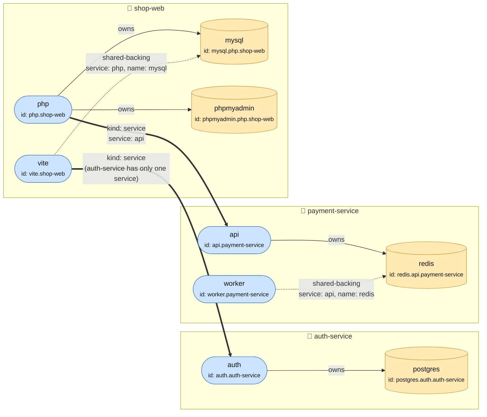

## Three distinct things

Every node in the resolved graph — a service built from a repo, or a
backing dependency like Postgres — needs three distinct identifiers, and
it's easy to accidentally conflate them:

1. **An id** — a stable internal key (map keys, override targets,
   container names, edges) that must never collide between two unrelated
   nodes.
2. **A label** — what a human reads on the graph. Friendly, short,
   author-chosen.
3. **A domain** — the actual `*.fghj.internal` hostname a browser or
   another container reaches it at. Must be derivable without any author
   input, or two independent authors could hand-pick the same one.

`fghj.yaml` only ever declares the label (`service.name`,
`dependency.name`). The id and the domain are both derived by `fghj`
itself — never author-declared, never something you can override with a
raw string in `fghj.yaml`.

## Why the id can't just be the label

Under [Flat workspace model](/concepts/flat-workspace-model/), any repo
can be a peer with no ownership relation to any other repo. Two teams can
each maintain their own service named `bff`, in their own repos, and never
know about each other. If a node's id were just the plain service name,
the second `bff` pulled into the workspace would silently collide with —
and potentially overwrite — the first one's node.

## The leaf-first, always-qualified convention

Every node id is a dotted chain, leaf (the specific thing) first, its
owning scope after:

- **Service**: `{service name}.{repo's workspace folder name}` — e.g.
  `bff.dept-a-repo`. The folder name is guaranteed unique because it comes
  from a real directory listing. This qualification applies
  *unconditionally*, not only when a collision is actually detected — if
  it were conditional, adding a second same-named peer repo later would
  retroactively change the *first* one's id and silently rehost its
  domain, which is worse than always paying the slightly longer id. A
  single repo's `services:` map can declare more than one service (see
  [fghj.yaml](/reference/fghj-yaml/#services)) — e.g. a `vite` dev-server
  and a `php` backend built from the same checkout — and this same rule is
  what keeps `vite.shop-web` and `php.shop-web` distinct: the map key
  (unique per repo, by construction) is the leaf, the folder name is the
  scope, exactly as it always was for the single-service case.
- **Backing dependency**: `{dep.name}.{owner's node id}` — e.g.
  `s3.bff.dept-a-repo`. The specific resource comes first, its owning
  scope after, matching the same convention used by named ports below.
  Because the owner's own id is already globally unique, this holds
  whether the owner is one of several services in the same repo
  (`mysql.php.shop-web`) or the sole service in its own repo — a repeated
  backing name like `postgres` or `redis` never collides across owners.
- **Shared-backing reference**: a service can bind to *another* service's
  already-declared backing dependency (rather than provisioning a second
  instance) via `kind: shared-backing`, identifying the owner by `repo` +
  `service` — a bare service name alone isn't unique (two peer repos, or
  two services in the same repo, can share one), so both are needed to
  pick a single unambiguous node. `repo` is optional: omitting it means
  "a sibling service declared in this same repo," which is exactly what
  lets two services built from one checkout (`vite` and `php` again)
  share one backing instance (`mysql`) without either of them owning a
  second copy. A reference that doesn't resolve to a known backing node is
  flagged as a non-fatal warning, since a stub (not-yet-pulled) repo can't
  be checked yet.
- **Named port**: `{port.name}.{node's own domain}` — the pattern repeats
  one more level down, at the port granularity.

A node's label stays the bare declared name throughout — it's what the UI
shows, and it's fine for it to collide with a peer's, the way two people
can share a first name.

## Worked example

Three repos: `auth-service` (one service), `payment-service` (two
services sharing a backing), and `shop-web` (two services, one of which
depends on `payment-service` cross-repo). Every label below is a real
node id, spelled out leaf-first exactly as described above:



Reading this against the rules above:

- Blue nodes are `#Service`s (buildable containers); orange cylinders are
  `kind: backing` nodes (provisioned from an image).
- A solid **owns** edge is a service's own `kind: backing` dependency.
- A dashed **shared-backing** edge binds to *another* service's already-
  owned backing instead of provisioning a second one — same-repo
  (`worker`→`redis`, `vite`→`mysql`) omits `repo` entirely, since the
  owner is a sibling declared in the same `services:` map.
- A thick **kind: service** edge is a cross-repo dependency. `php`→`api`
  needs `service: api` because `payment-service` declares two services;
  `vite`→`auth` omits it because `auth-service` only declares one.
- No two ids collide anywhere in this graph, even though `postgres`,
  `redis`, and `mysql` are all conceptually "the database" — each id's
  owning-scope suffix (`.auth.auth-service`, `.api.payment-service`,
  `.php.shop-web`) is unique per owner, so the generic leaf name never
  needs to be creative to stay collision-free.

## Ports: a port's role travels with the port

A service's `ports` is a map from port name to a `#Port` shape
(`{primary, name, host_port}`) — not a plain list of port numbers plus a
separate list of "which ports are HTTP routes" to keep in sync. That
structure makes an entire class of bug impossible: a route naming a port
the service never declared.

- `primary: true` puts that port at the node's own domain
  (`cart.myworkspace.fghj.internal`). At most one port per service should
  claim `primary` — more than one is flagged as a non-fatal warning.
- `name: "admin"` gives that port an *additional* nested domain,
  `admin.cart.myworkspace.fghj.internal`. A port can be both `primary` and
  `name`d at once.
- Neither: the port is still published to an ephemeral localhost port by
  Docker, just with no `*.fghj.internal` name — reachable only by raw port
  number.

This is what lets a service with more than one HTTP surface — a
Prometheus instance's scrape port plus its admin UI, say — expose both
under sensible names without any extra schema. See
[fghj.yaml](/reference/fghj-yaml/) for the full `#Port` shape.

## Domain derivation: one formula, no exceptions

No node kind can declare its own raw domain. Every node's domain is
derived the same way:

```rust
fn derive_domain(node_id, domain_scope, workspace_name, run_id) -> String {
    if domain_scope == "stable" || run_id == DEFAULT_RUN_ID {
        format!("{node_id}.{workspace}.fghj.internal")
    } else {
        format!("{node_id}.{run_id}.{workspace}.fghj.internal")
    }
}
```

`run_id` is folded in for named/review runs, since more than one can be
alive at once and each needs its own identity — but the **default run**
(the one shared per-workspace environment) drops it, so a service's
everyday URL is just `cart.myworkspace.fghj.internal`, not
`cart.default.myworkspace.fghj.internal`.

The other opt-out is per-node: a service or backing dependency can set
`domain_scope: "stable"` to drop the run id regardless of which run it's
in — a deliberate choice for something meant to keep one fixed identity
across every run of the graph (a shared Postgres instance, say). Only one
run can actually own a `"stable"`-scoped name from the host at a time, but
it's always the same name.

This derived domain is registered as the container's Docker network
alias, so it resolves identically whether asked from inside the run's own
Docker network or from the host via `fghjd`'s own DNS server — see
[Split DNS](/concepts/split-dns/).

## Limitations

The graph API pre-computes each node's *default-run* domain ahead of time,
before any container for that node has started, so the UI can show it
immediately. A named/review run gets a different, run-id-qualified domain
that this pre-computed value doesn't track — so a node's "domain" as shown
in the UI always reflects its default-run identity, even while you're
looking at a different run's live containers.
