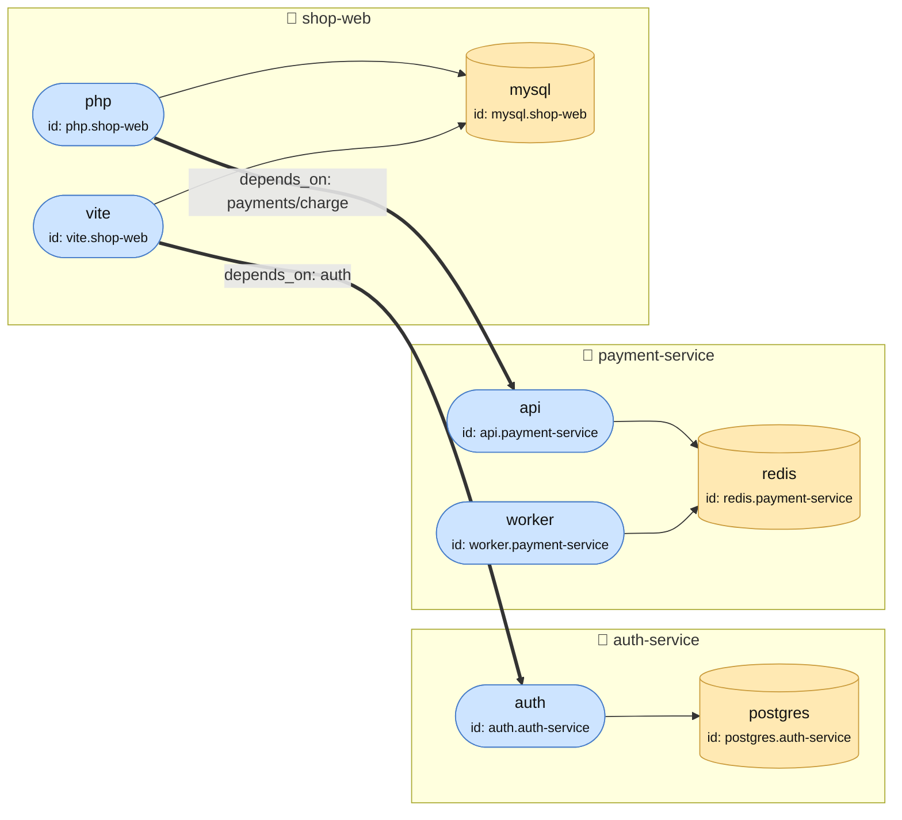

## Three distinct things

Every node in the resolved graph — a service built from a repo, or a
backing dependency like Postgres — needs three distinct identifiers, and
it's easy to accidentally conflate them:

1. **An id** — a stable internal key (map keys,
   container names, edges) that must never collide between two unrelated
   nodes.
2. **A label** — what a human reads on the graph. Friendly, short,
   author-chosen.
3. **A domain** — the actual `*.fghj.internal` hostname a browser or
   another container reaches it at. Must be derivable without any author
   input, or two independent authors could hand-pick the same one.

`.fghj.yaml` only ever declares the label (`service.name`,
`dependency.name`). The id and the domain are both derived by `fghj`
itself — never author-declared, never something you can override with a
raw string in `.fghj.yaml`.

## Why the id can't just be the label

Under [Flat workspace model](/concepts/flat-workspace-model/), any repo
can be a peer with no ownership relation to any other repo. Two teams can
each maintain their own service named `bff`, in their own repos, and never
know about each other. If a node's id were just the plain service name,
the second `bff` pulled into the workspace would silently collide with —
and potentially overwrite — the first one's node.

## The leaf-first, always-qualified convention

Every node id is a dotted chain, leaf (the specific thing) first, its
owning scope after:

- **Service**: `{service name}.{repo's workspace folder name}` — e.g.
  `bff.dept-a-repo`. The folder name is guaranteed unique because it comes
  from a real directory listing. This qualification applies
  *unconditionally*, not only when a collision is actually detected — if
  it were conditional, adding a second same-named peer repo later would
  retroactively change the *first* one's id and silently rehost its
  domain, which is worse than always paying the slightly longer id. A
  single repo's `services:` map can declare more than one service (see
  [.fghj.yaml](/reference/fghj-yaml/#services)) — e.g. a `vite` dev-server
  and a `php` backend built from the same checkout — and this same rule is
  what keeps `vite.shop-web` and `php.shop-web` distinct: the map key
  (unique per repo, by construction) is the leaf, the folder name is the
  scope, exactly as it always was for the single-service case.
- **Image-only service** (a database, a cache): the same rule. In 2.0
  Postgres is just another entry in `services:`, so its id is
  `postgres.auth-service` — no different from a built service's. Two repos
  each declaring `postgres` still never collide, because the folder name
  qualifies both.
- **Sharing one instance**: two services in a repo both `depends_on` the
  same `postgres` — there's one entry, so one node. Across repos, the
  owning repo publishes a flow containing it and the other repo depends on
  that flow; the node keeps its owner's id.
- **Named port**: `{port.name}.{node's own domain}` — the pattern repeats
  one more level down, at the port granularity.

A node's label stays the bare declared name throughout — it's what the UI
shows, and it's fine for it to collide with a peer's, the way two people
can share a first name.

## Worked example

Three repos: `auth-service` (one service and its Postgres),
`payment-service` (two services sharing one Redis), and `shop-web` (two
services sharing one MySQL, depending on the other two repos). Every label
below is a real node id:


```mermaid
flowchart LR
  subgraph REPO_A["📁 auth-service"]
    direction TB
    auth(["auth<br/><small>id: auth.auth-service</small>"])
    auth_pg[("postgres<br/><small>id: postgres.auth-service</small>")]
    auth --> auth_pg
  end

  subgraph REPO_B["📁 payment-service"]
    direction TB
    api(["api<br/><small>id: api.payment-service</small>"])
    worker(["worker<br/><small>id: worker.payment-service</small>"])
    redis[("redis<br/><small>id: redis.payment-service</small>")]
    api --> redis
    worker --> redis
  end

  subgraph REPO_C["📁 shop-web"]
    direction TB
    vite(["vite<br/><small>id: vite.shop-web</small>"])
    php(["php<br/><small>id: php.shop-web</small>"])
    mysql[("mysql<br/><small>id: mysql.shop-web</small>")]
    php --> mysql
    vite --> mysql
  end

  php == "depends_on: payments/charge" ==> api
  vite == "depends_on: auth" ==> auth

  classDef service fill:#cde4ff,stroke:#4a7fc9,stroke-width:1px,color:#111;
  classDef backing fill:#ffe9b3,stroke:#c99a3a,stroke-width:1px,color:#111;
  class auth,api,worker,vite,php service
  class auth_pg,redis,mysql backing
```

Reading this against the rules above:

- Blue nodes have `build:`; orange cylinders are image-only. Both are
  plain entries in `services:`, and both are named the same way.
- A thin arrow is a `depends_on` inside one repo. Sharing is just two
  arrows into one node — `worker` and `api` both wait on the one `redis`.
- A thick arrow is a `depends_on` across repos, through an `include:`
  alias. It names a flow (`payments/charge`, which payment-service
  publishes as `charge: [api]`) or a whole repo (`auth`) — never another
  repo's service, which is that repo's internal business.
- No two ids collide anywhere in this graph, even though `postgres`,
  `redis`, and `mysql` are all conceptually "the database" — the folder
  name suffix is unique per repo.

## Ports: a port's role travels with the port

A service's `ports` is a map from port name to a `#Port` shape
(`{primary, name, host_port}`) — not a plain list of port numbers plus a
separate list of "which ports are HTTP routes" to keep in sync. That
structure makes an entire class of bug impossible: a route naming a port
the service never declared.

- `primary: true` puts that port at the node's own domain
  (`cart.myworkspace.fghj.internal`). At most one port per service should
  claim `primary` — more than one is flagged as a non-fatal warning.
- `name: "admin"` gives that port an *additional* nested domain,
  `admin.cart.myworkspace.fghj.internal`. A port can be both `primary` and
  `name`d at once.
- Neither: the port is still published to an ephemeral localhost port by
  Docker, just with no `*.fghj.internal` name — reachable only by raw port
  number.

This is what lets a service with more than one HTTP surface — a
Prometheus instance's scrape port plus its admin UI, say — expose both
under sensible names without any extra schema. See
[.fghj.yaml](/reference/fghj-yaml/) for the full `#Port` shape.

## Domain derivation: one formula, no exceptions, two zones

No node kind can declare its own raw domain. Every node's domain — in
either zone — is derived the same way:

```rust
fn derive_domain(node_id, workspace_name, zone) -> String {
    let suffix = match zone {
        DomainZone::Http => "fghj.internal",
        DomainZone::Raw => "fghj.raw.internal",
    };
    format!("{node_id}.{workspace_name}.{suffix}")
}
```

Every node actually gets *two* domains out of this, one per `zone`, always
differing only in suffix: `cart.myworkspace.fghj.internal` (HTTP(S),
proxied, same address in or out of the run's docker network — see [Split
DNS](/concepts/split-dns/)) and `cart.myworkspace.fghj.raw.internal` (raw,
never TLS-terminated: from inside the network it resolves straight to the
container's own IP via Docker's native per-network DNS, and from the host
`fghjd` answers with a per-node virtual IP out of a `/16` it owns, NAT'd to
the port Docker published — so the name works from the host too, on the
port the author declared, for declared ports only). Only the raw domain is ever a real Docker network alias on the
node's own container; the http one is answered by the run's sidecar
instead, which is what makes it resolvable identically from inside and
outside the network with no per-consumer setup. In `.fghj.yaml`, the macro
`${FGHJ_SERVICE_FQDN:name}` expands to the *raw* domain by default (direct
access is what nearly every real caller needs — a database connection
string, an internal API call); `${FGHJ_SERVICE_FQDN_HTTP:name}` expands to
the http one instead, for the rarer case of needing the proxied identity on
purpose (e.g. minting a presigned URL meant to be handed to something
outside the network).

A workspace has exactly one environment, so nothing else needs folding
in: a node's domain is a pure function of where it's declared, known before
its container exists and unchanged by every restart.
