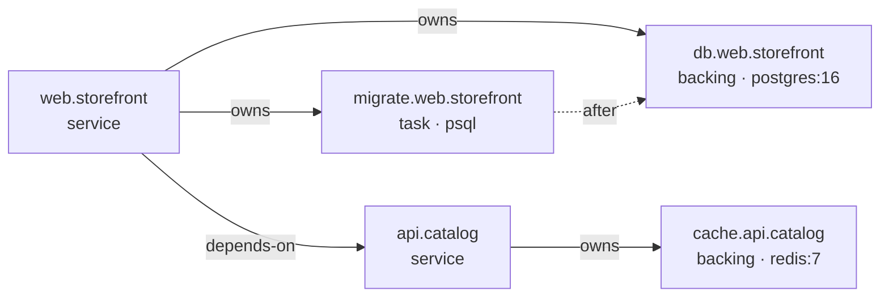

This is a book, not a reference. It starts with an empty directory and ends
with two repositories, four containers, a migration, a user flow, and two
environments running side by side — and it explains every piece as it
appears. Read it start to finish once; after that the
[.fghj.yaml reference](/reference/fghj-yaml/) is the page you'll actually
keep open.

Everything here is typed out in full. There is no starter repo to clone,
because half of what you're learning is *what the files look like* and why.

## What you'll build

A tiny shop, split across two repositories the way a real product is:

- **`storefront`** — the thing a shopper opens. It owns a Postgres
  database and a schema migration.
- **`catalog`** — a separate repo, owned (let's pretend) by a different
  team. It serves the product list and owns a Redis cache.

By the end, the resolved graph looks like this:



And `storefront` is reachable in your browser at
`https://web.storefront.shop.fghj.internal` — real HTTPS, a certificate
your system already trusts, no port numbers.

## The one idea

Nobody owns the graph.

There is no `docker-compose.yml`, no root manifest, no repo that knows
about all the others. Each repo carries a `.fghj.yaml` that declares only
what *it* needs. `storefront` names `catalog` as a dependency; `catalog`
has never heard of `storefront` and never will. The graph above is not
written down anywhere — fghj derives it by starting at one repo and walking
outward.

Every other design decision in fghj follows from that. When something
surprises you in a later chapter, it's usually this: the feature would have
required two repos to agree on something, and fghj refused. See
[Flat workspace model](/concepts/flat-workspace-model/) for the long
version.

## Before you start

You need:

- **macOS.** `fghjd` writes `/etc/resolver/fghj.internal` and installs a CA
  with `security`; neither has a Linux path yet.
- **Docker** running — Docker Desktop, OrbStack, or Colima.
- **`fghj` and `fghjd` installed**, and `fghjd` running. See
  [Installation](/getting-started/installation/).
- **`cue`** on your `PATH`, for `fghj validate`.
- **Node 22+** — only for `node --check` if you want to sanity-check the
  two tiny JavaScript files before Docker builds them. The containers bring
  their own Node.

Check the daemon is up before you start typing:

```bash
fghj daemon status
```

## The tutorial deliberately installs no npm packages

Both services are a single file using nothing but Node's standard library —
no `package.json`, no `npm install`, no lockfile. Where a real app would
use a Postgres driver or a Redis client, these open a TCP socket and speak
just enough of the protocol to prove the connection works. That keeps every
Docker build to three lines and keeps your attention on fghj rather than on
somebody's dependency tree.

## Chapters

1. [One service](/tutorial/01-one-service/) — a repo, a Dockerfile, a
   `.fghj.yaml`, and a real HTTPS domain.
2. [A database](/tutorial/02-a-database/) — a backing dependency, the raw
   zone, healthchecks, and a volume that survives.
3. [A migration](/tutorial/03-a-migration/) — the third node kind: one
   that's *supposed* to exit.
4. [A second repo](/tutorial/04-a-second-repo/) — cross-repo dependencies,
   and the two addresses every node has.
5. [Flows](/tutorial/05-flows/) — naming a user journey, and why it
   highlights rather than filters.
6. [Two runs at once](/tutorial/06-two-runs/) — review runs, and the two
   escape hatches that break them on purpose.
7. [When it goes wrong](/tutorial/07-when-it-goes-wrong/) — the status
   vocabulary, drift, `fghj exec`, and the daemon log.
